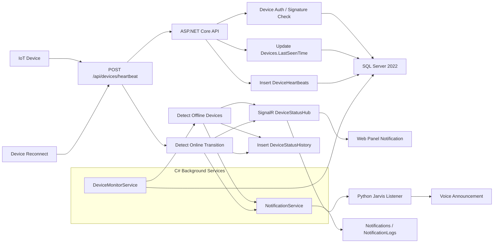

# Device Monitoring and Notification Architecture

## Goal

The smart home platform must track every IoT device as `Online` or `Offline` in real time. Devices send heartbeat requests to the C# backend. If a device does not send a heartbeat within the configured timeout window, the backend marks it as offline and broadcasts a real-time event through SignalR. Web clients and Python Jarvis subscribe to these events and notify the user.

## Architecture Diagram



## Event Flow

```text
Device -> Heartbeat -> C# API -> Database Update -> Status Check Service -> SignalR Event -> Web UI + Python Jarvis -> Notification
```

## Status Events

| Event | Meaning |
| --- | --- |
| `DeviceConnected` | Device moved from Offline or Unknown to Online |
| `DeviceDisconnected` | Device exceeded heartbeat timeout and moved to Offline |

## Timing Model

Recommended defaults:

| Setting | Value |
| --- | --- |
| Device heartbeat interval | 15 seconds |
| Backend monitor interval | 10 seconds |
| Offline timeout | 60 seconds |
| Reconnect debounce | 2 valid heartbeats or 10 seconds stable |

Use per-device overrides for battery-powered devices, cameras, hubs, and high-priority security devices.

## Offline Detection Algorithm

```text
now = current UTC time
for each active device:
    elapsed = now - device.LastSeenTime
    if device.Status == Online and elapsed > offlineTimeout:
        device.Status = Offline
        device.FailureCount += 1
        insert DeviceStatusHistory
        create notification
        broadcast SignalR DeviceDisconnected
```

## Reconnect Debounce Logic

A single heartbeat after a long gap can be caused by a network retry or delayed packet. To avoid notification noise:

```text
if device is Offline and heartbeat arrives:
    mark PendingOnline
    wait for N valid heartbeats or stable duration
    then mark Online
    broadcast DeviceConnected
```

Recommended policy:

- Critical wired devices: 1 valid heartbeat can reconnect.
- Wi-Fi devices: require 2 consecutive heartbeats.
- Battery devices: require 1 heartbeat, but use longer offline timeout.

## False Offline Prevention

- Timeout should be at least `3x heartbeatInterval`.
- Use server receive time, not client-provided time, for offline decisions.
- Allow per-device heartbeat intervals.
- Add a short grace window during backend deployment or network maintenance.
- Use `FailureCount` and status history before escalating to push notifications.
- Do not mark all devices offline immediately if the backend loses internet; emit a platform connectivity incident instead.

## Edge Cases

| Scenario | Strategy |
| --- | --- |
| Internet outage | Detect many simultaneous offline transitions and group notifications |
| Device reboot | Treat heartbeat with boot id/version as reconnect candidate |
| Fake heartbeat | Require device token, HMAC signature, nonce, and timestamp tolerance |
| Clock drift | Ignore device time for status, use server UTC |
| Duplicate heartbeat | Idempotently update `LastSeenTime`, keep logs sampled under load |
| Backend restart | Load last device state from database and resume monitor |
| SignalR disconnect | Clients re-fetch current device states after reconnect |
| Database outage | Buffer events if possible, keep API degraded but explicit |

## Scalability Recommendations

- Index `Devices(Status, LastSeenTime)`.
- Batch offline checks with a single SQL query.
- Store raw heartbeat logs with retention or sampling.
- Move heartbeat ingestion to a queue for high load.
- Use Redis backplane for SignalR scale-out.
- Partition heartbeat history by date for large deployments.
- Use per-device heartbeat policy instead of one global timeout.
- Avoid broadcasting unchanged status; only broadcast transitions.

