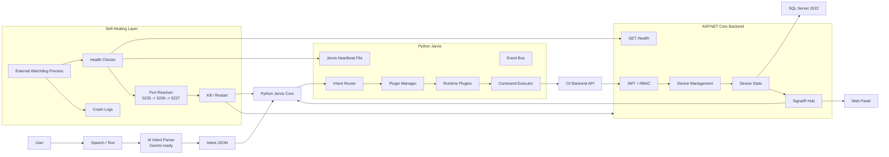

# Jarvis Smart Home Production Architecture

## Full System Architecture



## Plugin Architecture Design

Jarvis Core depends only on the plugin contract:

```python
class BasePlugin:
    name: str
    supported_intents: list[str]

    def validate(self) -> bool:
        ...

    async def execute(self, intent: dict, context: dict) -> dict:
        ...
```

Runtime flow:

```text
discover plugins -> load manifest -> validate -> register supported_intents -> route intent -> execute plugin
```

Implemented files:

- `jarvis_core/contracts/base_plugin.py`
- `jarvis_core/core/plugin_manager.py`
- `jarvis_core/core/intent_router.py`
- `jarvis_core/plugins/light_plugin/plugin.py`

New feature rule:

```text
Add new plugin folder + manifest + plugin.py. Do not change Jarvis Core.
```

## Auto-Restart System Design

Implemented watchdog:

```text
watchdog/jarvis_watchdog.py
```

It monitors:

- Backend: `GET http://localhost:5235/health`
- Jarvis: `runtime/jarvis_heartbeat.json`

Restart policy:

| Setting | Default |
| --- | --- |
| Check interval | 5 seconds |
| Max restarts | 3 |
| Restart window | 60 seconds |
| Cooldown | 5 seconds |
| Backend ports | 5235, 5236, 5237 |

## Process Monitoring Algorithm

```text
for each managed process:
    if process exited:
        restart with cooldown
    else if health check fails:
        terminate process
        clean occupied ports
        restart process
    if restart count > max retry in window:
        block restart and log incident
```

## Port Conflict Resolver

Windows strategy:

```text
netstat -ano -p tcp
find LISTENING process on port
taskkill /PID <pid> /F /T
retry 5235
fallback to 5236 or 5237 if needed
```

Implemented in:

```text
watchdog/jarvis_watchdog.py
```

## SQL Server 2022 Core Schema

Tables:

- `Users`
- `Devices`
- `DeviceStates`
- `Events`
- `PluginLogs`
- `CommandLogs`
- `SystemHealthLogs`
- `DeviceHeartbeats`
- `DeviceStatusHistory`
- `Notifications`
- `NotificationLogs`

Detailed schemas:

- `docs/sql_server_schema.sql`
- `docs/device_monitoring_sql_server_schema.sql`

## SignalR Real-Time Event Flow

```text
Device heartbeat -> Backend state update -> SignalR event -> Web panel + Jarvis listener
```

Events:

- `DeviceConnected`
- `DeviceDisconnected`

Current live panel:

```text
http://localhost:5235/panel
```

## Backend Health Endpoint

Implemented:

```http
GET /health
```

Response:

```json
{
  "status": "Healthy",
  "service": "Jarvis.Backend",
  "timeUtc": "2026-05-30T18:09:43Z",
  "deviceCount": 2,
  "notificationCount": 0,
  "processId": 2820
}
```

## Failure Handling Scenarios

| Scenario | Handling |
| --- | --- |
| Backend crash | Watchdog detects process exit and restarts backend |
| Backend stuck | `/health` fails, watchdog kills and restarts |
| Jarvis crash | Heartbeat file becomes stale, watchdog restarts Jarvis agent |
| Port conflict | Watchdog finds listener PID and kills stale process |
| Infinite restart loop | Restart blocked after 3 attempts in 60 seconds |
| Zombie process | Port cleanup uses `taskkill /F /T` |
| Plugin crash | Router catches exception and returns controlled failure |
| SignalR disconnect | Client reconnects and re-subscribes to home group |

## Zero-Downtime Restart Strategy

Development mode restarts in place. Production should use two backend instances:

```text
Backend A serving traffic
Start Backend B on fallback port
Verify B /health
Move traffic in reverse proxy
Stop Backend A
```

Recommended Windows stack:

- IIS or YARP reverse proxy
- Windows Service for backend
- Task Scheduler or Windows Service for watchdog
- SQL Server Agent or external log collector for health logs

## Production Deployment Strategy

Backend:

```powershell
dotnet publish .\Jarvis.Backend -c Release -o .\publish\Jarvis.Backend
```

Run published executable as Windows Service.

Jarvis:

```powershell
py -3 -m jarvis_core.app.agent
```

Watchdog:

```powershell
cd "Y:\Home Asistan"
.\scripts\install_watchdog_task.ps1
```

Logs:

```text
logs/watchdog.jsonl
```
