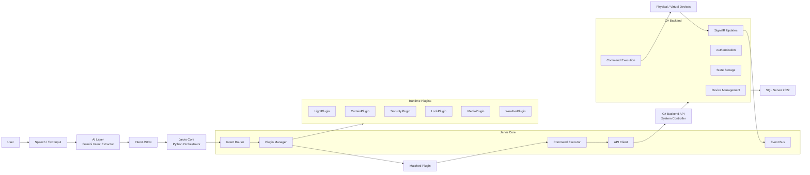

# Jarvis Plugin Architecture

## Goal

Jarvis Core does not generate AI responses. The AI layer only converts natural language into intent JSON. Jarvis Core validates the intent, routes it to the correct plugin, executes the plugin, and returns the result from the backend system controller.

Example AI output:

```json
{
  "intent": "light.turn_on",
  "confidence": 0.92,
  "entities": {
    "room": "salon"
  }
}
```

## Architecture Diagram



## Event Flow

```text
User -> Speech -> AI -> Intent JSON -> Jarvis Core -> Plugin Router -> Plugin Execute -> C# API -> Device -> Response
```

## Plugin Contract

Every plugin must expose:

- `name`
- `supported_intents`
- `validate()`
- `execute(intent, context)`

Jarvis Core only depends on this contract. New features are added by creating a new plugin directory and manifest.

## Lifecycle

```text
discover -> load -> validate -> register -> execute -> log -> unload/reload
```

## Hot Reload

The plugin directory is watched at runtime. When a `.py` or `.json` file changes:

```text
file changed -> debounce -> unload plugin -> remove intent mappings -> reload manifest -> validate -> register
```

If a new version fails validation, the plugin is not registered. In production, keeping the last stable version in memory is recommended.

## Plugin Isolation

Minimum isolation:

- execution timeout
- exception boundary
- structured logs
- intent conflict detection
- plugin validation

Stronger isolation:

- plugin subprocess
- IPC or gRPC between core and plugin host
- permission-based API client
- per-plugin rate limit
- per-plugin config and secrets boundary

