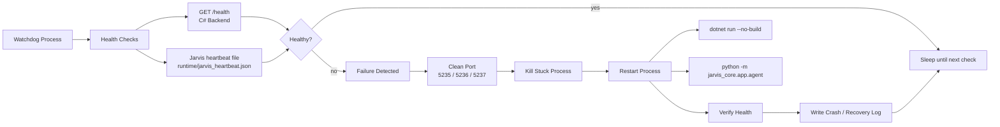

# Jarvis Auto Restart, Crash Recovery, and Self-Healing

## Architecture



## Implemented Pieces

- Backend health endpoint: `GET /health`
- Long-running Jarvis heartbeat agent: `py -3 -m jarvis_core.app.agent`
- External watchdog process: `py -3 -m watchdog.jarvis_watchdog`
- Local crash/recovery logs: `logs/watchdog.jsonl`
- Windows startup registration script: `scripts/install_watchdog_task.ps1`

## Health Checks

Backend:

```http
GET http://localhost:5235/health
```

Jarvis:

```text
runtime/jarvis_heartbeat.json
```

If the heartbeat file is stale for more than 15 seconds, Jarvis is considered unhealthy.

## Restart Policy

| Setting | Default |
| --- | --- |
| Check interval | 5 seconds |
| Max restarts | 3 |
| Restart window | 60 seconds |
| Cooldown | 5 seconds |
| Backend port | 5235 |

## Event Flow

```text
Watchdog -> Health Check -> Failure Detect -> Kill Process -> Clean Port -> Restart Service -> Verify Health -> Log Success
```

## Port Conflict Strategy

On Windows, the watchdog runs:

```text
netstat -ano -p tcp
```

If port `5235`, `5236`, or `5237` is occupied by a stale listener, it runs:

```text
taskkill /PID <pid> /F /T
```

Then it starts the backend again.

## Windows Startup

Register the watchdog as a Task Scheduler startup task:

```powershell
cd "Y:\Home Asistan"
.\scripts\install_watchdog_task.ps1
```

Run it manually:

```powershell
cd "Y:\Home Asistan"
.\scripts\start_watchdog.ps1
```

## Production Recommendations

- Run backend as a Windows Service or container instead of `dotnet run`.
- Publish backend with `dotnet publish` and watch the published executable.
- Use Windows Service Recovery options for first-level restart.
- Keep this watchdog as an external supervisor for multi-process coordination.
- Send `logs/watchdog.jsonl` into SQL Server, Seq, ELK, or OpenTelemetry.
- Add memory threshold checks before restart decisions.
- Add graceful drain endpoints for zero-downtime restart.
- Use two backend instances behind a reverse proxy for zero-downtime deploys.
- Move Jarvis plugins into isolated subprocesses for plugin crash containment.

## Zero-Downtime Restart Strategy

For production, do not restart the only backend instance in place. Use:

```text
Backend A healthy -> start Backend B -> health check B -> move traffic -> stop A
```

On Windows this can be done with IIS, YARP, nginx, or a service-aware load balancer.
